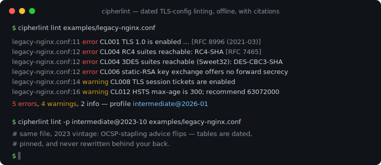
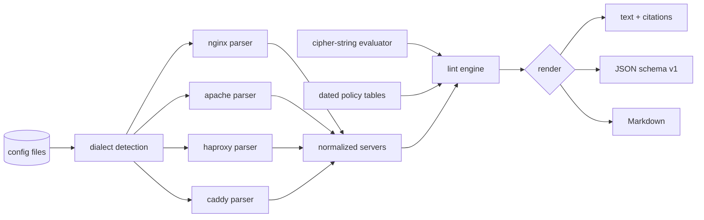

# cipherlint

[English](README.md) | [中文](README.zh.md) | [日本語](README.ja.md)

[](LICENSE) [](go.mod) [](CHANGELOG.md)  [](CONTRIBUTING.md)

**cipherlint：nginx・Caddy・Apache・HAProxy の TLS 設定を、日付つきベストプラクティス・プロファイルに照らして静的に検査するオープンソースのゼロ依存 CLI——設定ファイル解析のみ、実ハンドシェイク不要、すべての指摘に出典つき。**



```bash
git clone https://github.com/JaydenCJ/cipherlint && cd cipherlint
go build -o cipherlint ./cmd/cipherlint    # single static binary, stdlib only
```

> プレリリース：v0.1.0 はまだパッケージレジストリに公開されていません。上記の手順でソースからビルドしてください（Go ≥1.22 なら可）。

## なぜ cipherlint？

TLS 設定の「言い伝え」はすぐ腐ります。`ssl_stapling on`、`ssl_prefer_server_ciphers on`、RC4 時代のまま固定された暗号スイート文字列——どれもかつてはベストプラクティスで、どれも推奨が反転した後も本番設定に生き残っています。既存のチェッカーはすべて*稼働中*のエンドポイントを叩く方式です：testssl.sh と sslyze は本番への実ハンドシェイクが必要、SSL Labs はさらにホスト名を第三者へ送り、そしてどれも、設定ファイルが実際に変更される CI ジョブの中では走れません。Mozilla のジェネレーターは良い設定を書けますが、既存の設定を読み返せません。cipherlint はその隙間を埋めます：4 大サーバーの実際の設定文法を静的に解析し、OpenSSL 暗号文字列を厳選スイート表に対してオフラインで評価し、その結果を**日付つきのバージョン化ポリシー表**——`intermediate@2023-10` と `intermediate@2026-01` は別々に指定できる規則集で、公開済み版は決して書き換えられません——に照らして検査し、すべての指摘に根拠となる RFC・CVE・表の版を明記します。CI ではファイルを検査し、スキャナーは監査に取っておきましょう。

| | cipherlint | testssl.sh | sslyze | SSL Labs | Mozilla ジェネレーター |
|---|---|---|---|---|---|
| 設定ファイルを直接検査、デプロイ前に使える | ✅ | ❌ 稼働ホスト必須 | ❌ 稼働ホスト必須 | ❌ 稼働ホスト必須 | ❌ 書くだけ |
| ネットワーク / ハンドシェイク不要 | ✅ | ❌ | ❌ | ❌ SaaS | ✅ |
| nginx + Apache + HAProxy + Caddy の 4 方言 | ✅ | n/a | n/a | n/a | ✅（生成のみ） |
| 日付つきで固定できる規則集 | ✅ `name@date` | ❌ | ❌ | ❌ 評価基準が漂流 | 一部（設定タグ） |
| すべての指摘に出典 | ✅ | 一部 | ❌ | ❌ | ❌ |
| ランタイム依存 | 0 | bash + OpenSSL | Python + 依存 | n/a | n/a |

<sub>依存数は 2026-07-13 に確認：cipherlint は Go 標準ライブラリのみを import；sslyze 6.x は PyPI から 7 つのランタイムパッケージを取得；testssl.sh は bash と同梱またはシステムの OpenSSL バイナリを必要とします。</sub>

## 機能

- **4 方言・実文法対応** —— http→server 継承と conf.d スニペットを含む nginx ディレクティブ木、加減算式 `SSLProtocol` 構文の Apache バーチャルホスト、`ssl-min-ver` や `no-*` オプションを含む HAProxy の global/bind マージ、Caddyfile のサイトブロック——さらに内容ベースの自動判別と `--server` での上書き。
- **OpenSSL 暗号文字列のオフライン評価** —— `!`/`-`/`+` 演算子、`ECDHE+AESGCM` の積集合、`@STRENGTH`、約 50 スイートの厳選表に対する約 30 のキーワード；タイプミスは OpenSSL のように黙殺されず、指摘になります。
- **固定できる日付つきポリシー表** —— `-p intermediate@2023-10` は 2023 年 10 月時点の推奨を永遠に適用；裸の名前は最新版に解決；2026-01 の表は OCSP ステープリング推奨を撤回し、理由も示します。
- **デフォルト値も検査対象** —— `SSLProtocol` を書いていない Apache バーチャルホストは TLS 1.0/1.1 で警告されます。httpd の組み込みデフォルト（`all -SSLv3`）がそれらを有効にするからで、指摘には値がデフォルト由来であることが明記されます。
- **すべての指摘に出典** —— RFC 8996、RFC 7465、Sweet32、Logjam、あるいは正確な表の版；`cipherlint explain CL013` はどの規則の背景も表示します。
- **CI ゲートのための設計** —— 決定的な出力、`--fail-on error|warning|info`、終了コード 0/1/2/3、そして text・安定 JSON（`schema_version: 1`）・PR 向け Markdown。
- **ゼロ依存・完全オフライン** —— Go 標準ライブラリのみ；cipherlint はソケットを一切開きません。テレメトリなし、ネットワークなし、常に。

## クイックスタート

```bash
./cipherlint lint examples/legacy-nginx.conf
```

実際にキャプチャした出力（指摘の一部を抜粋、各行は原文どおり）：

```text
examples/legacy-nginx.conf:11  error    CL001  TLS 1.0 is enabled; it is formally deprecated and every dated profile since 2021 forbids it [RFC 8996 (2021-03); RFC 7568 (SSLv3, 2015-06); RFC 6176 (SSLv2, 2011-03)]
examples/legacy-nginx.conf:11  warning  CL003  TLS 1.3 is not among the enabled versions [RFC 8446 (2018-08); profile table]
examples/legacy-nginx.conf:12  error    CL004  RC4 suites reachable; RFC 7465 prohibits RC4 in TLS: RC4-SHA [RFC 7465 (RC4, 2015-02); Sweet32 CVE-2016-2183 (3DES, 2016-08); FREAK CVE-2015-0204 (export, 2015-03)]
examples/legacy-nginx.conf:12  error    CL006  static-RSA key exchange offers no forward secrecy: AES256-GCM-SHA384, AES128-GCM-SHA256, AES256-SHA256, AES128-SHA256, AES256-SHA, … (8 total) [RFC 9325 §4.1 (2022-11); profile table]
examples/legacy-nginx.conf:14  warning  CL008  TLS session tickets are enabled; unrotated ticket keys defeat forward secrecy for resumed sessions [profile table; RFC 9325 §4.3.3 (2022-11)]
examples/legacy-nginx.conf:16  warning  CL012  HSTS max-age is 300; the intermediate profile recommends at least 63072000 (two years) [RFC 6797 §6.1.1; profile table]
5 errors, 4 warnings, 2 info — profile intermediate@2026-01, 1 server, 1 file
```

表の年代を固定すれば推奨も一緒に変わります——同じファイルの `ssl_stapling on` は 2023 年の表ではまさに推奨どおり、2026 年の表では無用の重り（実出力）：

```text
$ ./cipherlint lint -p intermediate@2023-10 examples/legacy-nginx.conf | grep -c CL013
0
$ ./cipherlint lint -p intermediate@2026-01 examples/legacy-nginx.conf | grep CL013
examples/legacy-nginx.conf:5   info     CL013  OCSP stapling is on, but major CAs ended OCSP service in 2025 — the directive is now dead weight for most certificates [2023 tables: Mozilla v5.7; 2026 tables: Let's Encrypt ended OCSP support (2025-08)]
```

## 日付つきプロファイル

プロファイルは `name@date` で指定します。裸の名前は最新版に解決され、公開済み版は決して書き換えられません。完全な表と理由づけは [docs/rules.md](docs/rules.md) を参照。

| プロファイル | 下限 | 暗号スイート方針 | ステープリング推奨 | 出典 |
|---|---|---|---|---|
| `modern@2023-10` / `@2026-01` | TLS 1.3 のみ | 1.3 スイート（固定） | on → 退役 | Mozilla v5.7 → 本リポジトリ 2026-01 表 |
| `intermediate@2023-10` / `@2026-01` | TLS 1.2 | 前方秘匿 AEAD のみ | on → 退役 | Mozilla v5.7 → 本リポジトリ 2026-01 表 |
| `old@2023-10` / `@2026-01` | TLS 1.0（警告） | CBC 許容 | on → 退役 | Mozilla v5.7 → 本リポジトリ 2026-01 表 |

15 の規則（CL001–CL015）はプロトコル、破られた・レガシーな暗号スイート、前方秘匿性、スイート順序、セッションチケット、DH パラメータ、楕円曲線、HSTS、OCSP ステープリングを網羅；`cipherlint explain <rule>` が各規則を解説し、[docs/cipher-strings.md](docs/cipher-strings.md) は OpenSSL 暗号文字列言語のどのサブセットをモデル化したかを正確に規定します。

## CLI リファレンス

`cipherlint [lint|profiles|explain|version] [flags] <file>...` —— デフォルトのサブコマンドは `lint`。終了コード：0 問題なし、1 `--fail-on` 閾値以上の指摘あり、2 使い方エラー、3 実行時エラー。

| フラグ | デフォルト | 効果 |
|---|---|---|
| `-p`, `--profile` | `intermediate`（最新日付） | ポリシープロファイル、日付固定も可：`intermediate@2023-10` |
| `--server` | 自動判別 | 方言を強制指定：`nginx`・`apache`・`haproxy`・`caddy` |
| `--format` | `text` | `text`・`json`（安定エンベロープ、`schema_version: 1`）・`markdown` |
| `--fail-on` | `error` | 終了コード 1 の重大度閾値：`error`・`warning`・`info` |

## 検証

このリポジトリは CI を同梱しません。上記のすべての主張はローカル実行で検証されます：

```bash
go test ./...            # 90 個の決定的テスト、オフライン、5 秒未満
bash scripts/smoke.sh    # 4 方言すべてを通すエンドツーエンド CLI 検査、SMOKE OK を出力
```

## アーキテクチャ



## ロードマップ

- [x] v0.1.0 —— 4 方言パーサー、オフライン暗号文字列評価、日付つきポリシー表（2023-10 / 2026-01）、出典つき 15 規則、text/JSON/Markdown 出力、`--fail-on` ゲート、90 テスト + smoke スクリプト
- [ ] `--fix` モード：プロファイル到達に必要な最小 diff を出力
- [ ] `include` / `Include` ディレクティブのファイル横断追跡
- [ ] postfix/dovecot/exim メールサーバー TLS 方言
- [ ] コードスキャン連携のための SARIF 出力
- [ ] ポスト量子ハイブリッド鍵交換の指針を反映する `2026-07` 表版

全リストは [open issues](https://github.com/JaydenCJ/cipherlint/issues) を参照。

## コントリビュート

Issue・ディスカッション・プルリクエストを歓迎します——ローカルの作業フロー（フォーマット、vet、テスト、`SMOKE OK`）と「公開済み表版は不変」という原則は [CONTRIBUTING.md](CONTRIBUTING.md) を参照。入門タスクは [good first issue](https://github.com/JaydenCJ/cipherlint/issues?q=is%3Aissue+is%3Aopen+label%3A%22good+first+issue%22) ラベル、設計の議論は [Discussions](https://github.com/JaydenCJ/cipherlint/discussions) へ。

## ライセンス

[MIT](LICENSE)
