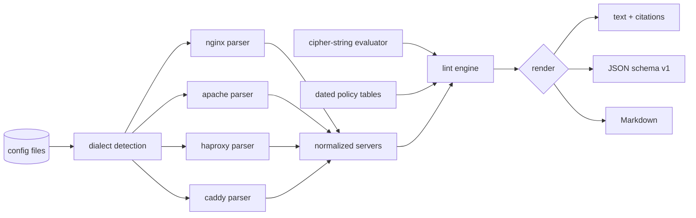

# cipherlint

[English](README.md) | [中文](README.zh.md) | [日本語](README.ja.md)

[](LICENSE) [](go.mod) [](CHANGELOG.md)  [](CONTRIBUTING.md)

**cipherlint：an open-source, zero-dependency CLI that lints nginx, Caddy, Apache and HAProxy TLS configs against dated best-practice profiles — pure config-file analysis, no live handshakes, a citation for every finding.**


```bash
git clone https://github.com/JaydenCJ/cipherlint && cd cipherlint
go build -o cipherlint ./cmd/cipherlint    # single static binary, stdlib only
```

> Pre-release: v0.1.0 is not tagged on a package registry yet; build from source as above (any Go ≥1.22).

## Why cipherlint?

TLS configuration folklore rots fast. `ssl_stapling on`, `ssl_prefer_server_ciphers on`, a pinned RC4-era cipher string — each was best practice once, and each survives in production configs long after the advice flipped. The existing checkers all interrogate a *running* endpoint: testssl.sh and sslyze need a live handshake against production, SSL Labs additionally ships your hostname to a third party, and none of them can run in the CI job where the config file actually changes. Mozilla's generator writes good configs but cannot read yours back. cipherlint closes that gap: it statically parses the four major servers' real config grammars, evaluates OpenSSL cipher strings offline against a curated suite table, and checks the result against **versioned, dated policy tables** — `intermediate@2023-10` and `intermediate@2026-01` are different, addressable rulesets, shipped editions are never rewritten, and every finding cites the RFC, CVE or table edition it rests on. Lint the file in CI; save the scanner for the audit.

| | cipherlint | testssl.sh | sslyze | SSL Labs | Mozilla generator |
|---|---|---|---|---|---|
| Works on config files, pre-deploy | ✅ | ❌ live host | ❌ live host | ❌ live host | ❌ write-only |
| Needs no network / handshake | ✅ | ❌ | ❌ | ❌ SaaS | ✅ |
| nginx + Apache + HAProxy + Caddy dialects | ✅ | n/a | n/a | n/a | ✅ (generate only) |
| Dated, pinnable rulesets | ✅ `name@date` | ❌ | ❌ | ❌ grades drift | partial (config tags) |
| Citation on every finding | ✅ | partial | ❌ | ❌ | ❌ |
| Runtime dependencies | 0 | bash + OpenSSL | Python + deps | n/a | n/a |

<sub>Dependency counts checked 2026-07-13: cipherlint imports the Go standard library only; sslyze 6.x pulls 7 runtime packages from PyPI; testssl.sh requires bash plus a bundled or system OpenSSL binary.</sub>

## Features

- **Four dialects, real grammars** — nginx directive trees with http→server inheritance and conf.d snippets, Apache vhosts with the additive `SSLProtocol` syntax, HAProxy global/bind merging with `ssl-min-ver` and `no-*` options, Caddyfile site blocks — plus content-based auto-detection and a `--server` override.
- **Offline OpenSSL cipher-string evaluation** — `!`/`-`/`+` operators, `ECDHE+AESGCM` intersections, `@STRENGTH`, ~30 keywords over a curated table of ~50 suites; typos become findings instead of being silently ignored like OpenSSL does.
- **Dated policy tables you can pin** — `-p intermediate@2023-10` applies October-2023 advice forever; bare names resolve to the newest edition; the 2026-01 tables retire the OCSP-stapling recommendation and say why.
- **Defaults are linted too** — an Apache vhost with no `SSLProtocol` line is flagged for TLS 1.0/1.1, because httpd's compiled-in default (`all -SSLv3`) enables them; the finding says the value came from a default.
- **A citation on every finding** — RFC 8996, RFC 7465, Sweet32, Logjam, or the exact table edition; `cipherlint explain CL013` prints the reasoning behind any rule.
- **Built for CI gates** — deterministic output, `--fail-on error|warning|info`, exit codes 0/1/2/3, and text, stable JSON (`schema_version: 1`) or PR-ready Markdown.
- **Zero dependencies, fully offline** — Go standard library only; cipherlint never opens a socket. No telemetry, no network, ever.

## Quickstart

```bash
./cipherlint lint examples/legacy-nginx.conf
```

Real captured output (a selection of the findings, each line verbatim):

```text
examples/legacy-nginx.conf:11  error    CL001  TLS 1.0 is enabled; it is formally deprecated and every dated profile since 2021 forbids it [RFC 8996 (2021-03); RFC 7568 (SSLv3, 2015-06); RFC 6176 (SSLv2, 2011-03)]
examples/legacy-nginx.conf:11  warning  CL003  TLS 1.3 is not among the enabled versions [RFC 8446 (2018-08); profile table]
examples/legacy-nginx.conf:12  error    CL004  RC4 suites reachable; RFC 7465 prohibits RC4 in TLS: RC4-SHA [RFC 7465 (RC4, 2015-02); Sweet32 CVE-2016-2183 (3DES, 2016-08); FREAK CVE-2015-0204 (export, 2015-03)]
examples/legacy-nginx.conf:12  error    CL006  static-RSA key exchange offers no forward secrecy: AES256-GCM-SHA384, AES128-GCM-SHA256, AES256-SHA256, AES128-SHA256, AES256-SHA, … (8 total) [RFC 9325 §4.1 (2022-11); profile table]
examples/legacy-nginx.conf:14  warning  CL008  TLS session tickets are enabled; unrotated ticket keys defeat forward secrecy for resumed sessions [profile table; RFC 9325 §4.3.3 (2022-11)]
examples/legacy-nginx.conf:16  warning  CL012  HSTS max-age is 300; the intermediate profile recommends at least 63072000 (two years) [RFC 6797 §6.1.1; profile table]
5 errors, 4 warnings, 2 info — profile intermediate@2026-01, 1 server, 1 file
```

Pin the table vintage and the advice changes with it — the same file's `ssl_stapling on` is exactly what the 2023 tables recommend, and dead weight under the 2026 tables (real output):

```text
$ ./cipherlint lint -p intermediate@2023-10 examples/legacy-nginx.conf | grep -c CL013
0
$ ./cipherlint lint -p intermediate@2026-01 examples/legacy-nginx.conf | grep CL013
examples/legacy-nginx.conf:5   info     CL013  OCSP stapling is on, but major CAs ended OCSP service in 2025 — the directive is now dead weight for most certificates [2023 tables: Mozilla v5.7; 2026 tables: Let's Encrypt ended OCSP support (2025-08)]
```

## Dated profiles

A profile is `name@date`; bare names resolve to the newest edition, and shipped editions are never rewritten. Full tables and reasoning live in [docs/rules.md](docs/rules.md).

| Profile | Floor | Cipher policy | Stapling advice | Source |
|---|---|---|---|---|
| `modern@2023-10` / `@2026-01` | TLS 1.3 only | 1.3 suites (fixed) | on → retired | Mozilla v5.7 → this repo's 2026-01 table |
| `intermediate@2023-10` / `@2026-01` | TLS 1.2 | forward-secret AEAD only | on → retired | Mozilla v5.7 → this repo's 2026-01 table |
| `old@2023-10` / `@2026-01` | TLS 1.0 (warned) | CBC tolerated | on → retired | Mozilla v5.7 → this repo's 2026-01 table |

The 15 rules (CL001–CL015) cover protocols, broken and legacy ciphers, forward secrecy, cipher ordering, session tickets, DH parameters, curves, HSTS and OCSP stapling; `cipherlint explain <rule>` documents each one, and [docs/cipher-strings.md](docs/cipher-strings.md) specifies exactly which subset of OpenSSL's cipher-string language is modeled.

## CLI reference

`cipherlint [lint|profiles|explain|version] [flags] <file>...` — `lint` is the default. Exit codes: 0 clean, 1 findings at/above `--fail-on`, 2 usage error, 3 runtime error.

| Flag | Default | Effect |
|---|---|---|
| `-p`, `--profile` | `intermediate` (newest date) | policy profile, optionally pinned: `intermediate@2023-10` |
| `--server` | auto-detect | force the dialect: `nginx`, `apache`, `haproxy`, `caddy` |
| `--format` | `text` | `text`, `json` (stable envelope, `schema_version: 1`), or `markdown` |
| `--fail-on` | `error` | severity threshold for exit code 1: `error`, `warning`, `info` |

## Verification

This repository ships no CI; every claim above is verified by local runs:

```bash
go test ./...            # 90 deterministic tests, offline, < 5 s
bash scripts/smoke.sh    # end-to-end CLI check over all four dialects, prints SMOKE OK
```

## Architecture



## Roadmap

- [x] v0.1.0 — four dialect parsers, offline cipher-string evaluation, dated policy tables (2023-10 / 2026-01), 15 cited rules, text/JSON/Markdown output, `--fail-on` gate, 90 tests + smoke script
- [ ] `--fix` mode emitting the minimal diff to reach a profile
- [ ] Follow `include` / `Include` directives across files
- [ ] postfix/dovecot/exim mail-server TLS dialects
- [ ] SARIF output for code-scanning integrations
- [ ] A `2026-07` table edition tracking post-quantum hybrid key-exchange guidance

See the [open issues](https://github.com/JaydenCJ/cipherlint/issues) for the full list.

## Contributing

Issues, discussions and pull requests are welcome — see [CONTRIBUTING.md](CONTRIBUTING.md) for the local workflow (format, vet, tests, `SMOKE OK`) and the ground rule that shipped table editions are immutable. Good entry points are labelled [good first issue](https://github.com/JaydenCJ/cipherlint/issues?q=is%3Aissue+is%3Aopen+label%3A%22good+first+issue%22), and design questions live in [Discussions](https://github.com/JaydenCJ/cipherlint/discussions).

## License

[MIT](LICENSE)
