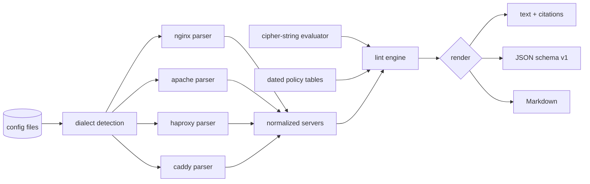

# cipherlint

[English](README.md) | [中文](README.zh.md) | [日本語](README.ja.md)

[](LICENSE) [](go.mod) [](CHANGELOG.md)  [](CONTRIBUTING.md)

**cipherlint：开源零依赖 CLI，按带日期版本的最佳实践档案静态检查 nginx、Caddy、Apache、HAProxy 的 TLS 配置——纯配置文件分析，无需真实握手，每条结论都附出处。**


```bash
git clone https://github.com/JaydenCJ/cipherlint && cd cipherlint
go build -o cipherlint ./cmd/cipherlint    # single static binary, stdlib only
```

> 预发布说明：v0.1.0 尚未发布到任何包管理仓库；请按上述方式从源码构建（Go ≥1.22 均可）。

## 为什么选 cipherlint？

TLS 配置的"民间经验"腐烂得很快。`ssl_stapling on`、`ssl_prefer_server_ciphers on`、钉死在 RC4 时代的 cipher 串——每一条都曾是最佳实践，也都在建议反转之后继续活在生产配置里。现有检查工具全都要探测*正在运行*的端点：testssl.sh 和 sslyze 需要对生产环境做真实握手，SSL Labs 还会把你的主机名交给第三方，而它们没有一个能跑在配置文件真正发生变更的那个 CI 任务里。Mozilla 生成器能写出好配置，却读不回你已有的配置。cipherlint 补上了这个缺口：静态解析四大服务器的真实配置语法，离线基于精选套件表求值 OpenSSL cipher 字符串，再对照**带日期的版本化策略表**检查——`intermediate@2023-10` 和 `intermediate@2026-01` 是两套可分别指定的规则，已发布的版本永不改写，每条结论都注明其依据的 RFC、CVE 或表版本。在 CI 里检查文件；把扫描器留给审计。

| | cipherlint | testssl.sh | sslyze | SSL Labs | Mozilla 生成器 |
|---|---|---|---|---|---|
| 直接检查配置文件、部署前可用 | ✅ | ❌ 需在线主机 | ❌ 需在线主机 | ❌ 需在线主机 | ❌ 只写不读 |
| 无需网络 / 握手 | ✅ | ❌ | ❌ | ❌ SaaS | ✅ |
| nginx + Apache + HAProxy + Caddy 四种方言 | ✅ | n/a | n/a | n/a | ✅（仅生成） |
| 带日期、可钉住的规则集 | ✅ `name@date` | ❌ | ❌ | ❌ 评分会漂移 | 部分（配置标签） |
| 每条结论附出处 | ✅ | 部分 | ❌ | ❌ | ❌ |
| 运行时依赖 | 0 | bash + OpenSSL | Python + 依赖 | n/a | n/a |

<sub>依赖数核对于 2026-07-13：cipherlint 仅导入 Go 标准库；sslyze 6.x 从 PyPI 拉取 7 个运行时包；testssl.sh 需要 bash 加捆绑或系统 OpenSSL 二进制。</sub>

## 功能特性

- **四种方言、真实语法** —— nginx 指令树含 http→server 继承与 conf.d 片段，Apache 虚拟主机含加减式 `SSLProtocol` 语法，HAProxy 的 global/bind 合并含 `ssl-min-ver` 与 `no-*` 选项，Caddyfile 站点块——外加基于内容的自动识别与 `--server` 覆盖。
- **离线求值 OpenSSL cipher 字符串** —— `!`/`-`/`+` 操作符、`ECDHE+AESGCM` 交集、`@STRENGTH`，约 30 个关键字作用于约 50 个套件的精选表；拼写错误会成为结论，而不是像 OpenSSL 那样被静默忽略。
- **可钉住的带日期策略表** —— `-p intermediate@2023-10` 永远应用 2023 年 10 月的建议；裸名解析到最新版本；2026-01 表撤回了 OCSP stapling 推荐并说明原因。
- **默认值也会被检查** —— 没写 `SSLProtocol` 的 Apache 虚拟主机会因 TLS 1.0/1.1 被标记，因为 httpd 的编译内置默认值（`all -SSLv3`）启用了它们；结论会注明该值来自默认。
- **每条结论都有出处** —— RFC 8996、RFC 7465、Sweet32、Logjam，或确切的表版本；`cipherlint explain CL013` 打印任一规则背后的推理。
- **为 CI 门禁而生** —— 确定性输出、`--fail-on error|warning|info`、退出码 0/1/2/3，以及 text、稳定 JSON（`schema_version: 1`）或适合 PR 的 Markdown。
- **零依赖、完全离线** —— 仅 Go 标准库；cipherlint 从不打开套接字。无遥测、无网络，永远如此。

## 快速上手

```bash
./cipherlint lint examples/legacy-nginx.conf
```

真实捕获输出（节选部分结论，每行逐字未改）：

```text
examples/legacy-nginx.conf:11  error    CL001  TLS 1.0 is enabled; it is formally deprecated and every dated profile since 2021 forbids it [RFC 8996 (2021-03); RFC 7568 (SSLv3, 2015-06); RFC 6176 (SSLv2, 2011-03)]
examples/legacy-nginx.conf:11  warning  CL003  TLS 1.3 is not among the enabled versions [RFC 8446 (2018-08); profile table]
examples/legacy-nginx.conf:12  error    CL004  RC4 suites reachable; RFC 7465 prohibits RC4 in TLS: RC4-SHA [RFC 7465 (RC4, 2015-02); Sweet32 CVE-2016-2183 (3DES, 2016-08); FREAK CVE-2015-0204 (export, 2015-03)]
examples/legacy-nginx.conf:12  error    CL006  static-RSA key exchange offers no forward secrecy: AES256-GCM-SHA384, AES128-GCM-SHA256, AES256-SHA256, AES128-SHA256, AES256-SHA, … (8 total) [RFC 9325 §4.1 (2022-11); profile table]
examples/legacy-nginx.conf:14  warning  CL008  TLS session tickets are enabled; unrotated ticket keys defeat forward secrecy for resumed sessions [profile table; RFC 9325 §4.3.3 (2022-11)]
examples/legacy-nginx.conf:16  warning  CL012  HSTS max-age is 300; the intermediate profile recommends at least 63072000 (two years) [RFC 6797 §6.1.1; profile table]
5 errors, 4 warnings, 2 info — profile intermediate@2026-01, 1 server, 1 file
```

钉住表的年份，建议随之改变——同一文件里的 `ssl_stapling on` 恰是 2023 年表所推荐的，而在 2026 年表下则是无用负担（真实输出）：

```text
$ ./cipherlint lint -p intermediate@2023-10 examples/legacy-nginx.conf | grep -c CL013
0
$ ./cipherlint lint -p intermediate@2026-01 examples/legacy-nginx.conf | grep CL013
examples/legacy-nginx.conf:5   info     CL013  OCSP stapling is on, but major CAs ended OCSP service in 2025 — the directive is now dead weight for most certificates [2023 tables: Mozilla v5.7; 2026 tables: Let's Encrypt ended OCSP support (2025-08)]
```

## 带日期的档案

档案的写法是 `name@date`；裸名解析到最新版本，且已发布的版本永不改写。完整表格与推理见 [docs/rules.md](docs/rules.md)。

| 档案 | 协议下限 | 密码套件策略 | Stapling 建议 | 来源 |
|---|---|---|---|---|
| `modern@2023-10` / `@2026-01` | 仅 TLS 1.3 | 1.3 套件（固定） | 开启 → 已退役 | Mozilla v5.7 → 本仓库 2026-01 表 |
| `intermediate@2023-10` / `@2026-01` | TLS 1.2 | 仅前向保密 AEAD | 开启 → 已退役 | Mozilla v5.7 → 本仓库 2026-01 表 |
| `old@2023-10` / `@2026-01` | TLS 1.0（警告） | 容忍 CBC | 开启 → 已退役 | Mozilla v5.7 → 本仓库 2026-01 表 |

15 条规则（CL001–CL015）覆盖协议、已破解与遗留密码套件、前向保密、套件排序、会话票据、DH 参数、椭圆曲线、HSTS 与 OCSP stapling；`cipherlint explain <rule>` 逐条给出文档，[docs/cipher-strings.md](docs/cipher-strings.md) 精确说明建模了 OpenSSL cipher 字符串语言的哪个子集。

## CLI 参考

`cipherlint [lint|profiles|explain|version] [flags] <file>...` —— `lint` 为默认子命令。退出码：0 干净，1 存在达到 `--fail-on` 阈值的结论，2 用法错误，3 运行时错误。

| 参数 | 默认值 | 作用 |
|---|---|---|
| `-p`, `--profile` | `intermediate`（最新日期） | 策略档案，可钉住日期：`intermediate@2023-10` |
| `--server` | 自动识别 | 强制指定方言：`nginx`、`apache`、`haproxy`、`caddy` |
| `--format` | `text` | `text`、`json`（稳定信封，`schema_version: 1`）或 `markdown` |
| `--fail-on` | `error` | 触发退出码 1 的严重度阈值：`error`、`warning`、`info` |

## 验证

本仓库不附带 CI；上述所有断言均由本地运行验证：

```bash
go test ./...            # 90 个确定性测试，离线，< 5 秒
bash scripts/smoke.sh    # 覆盖全部四种方言的端到端 CLI 检查，输出 SMOKE OK
```

## 架构



## 路线图

- [x] v0.1.0 —— 四种方言解析器、离线 cipher 字符串求值、带日期策略表（2023-10 / 2026-01）、15 条带出处规则、text/JSON/Markdown 输出、`--fail-on` 门禁、90 个测试 + smoke 脚本
- [ ] `--fix` 模式：输出达到某档案所需的最小 diff
- [ ] 跨文件跟随 `include` / `Include` 指令
- [ ] postfix/dovecot/exim 邮件服务器 TLS 方言
- [ ] SARIF 输出，对接代码扫描平台
- [ ] `2026-07` 表版本，跟进后量子混合密钥交换指引

完整列表见 [open issues](https://github.com/JaydenCJ/cipherlint/issues)。

## 参与贡献

欢迎 issue、讨论与 pull request——本地工作流（格式化、vet、测试、`SMOKE OK`）以及"已发布表版本不可变"这条底线见 [CONTRIBUTING.md](CONTRIBUTING.md)。入门任务见 [good first issue](https://github.com/JaydenCJ/cipherlint/issues?q=is%3Aissue+is%3Aopen+label%3A%22good+first+issue%22) 标签，设计讨论在 [Discussions](https://github.com/JaydenCJ/cipherlint/discussions)。

## 许可证

[MIT](LICENSE)
